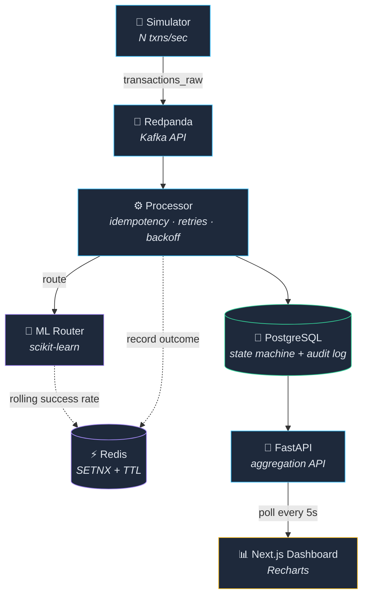

<div align="center">

# 🎛️ Meridian

### Intelligent Payment Routing & Reconciliation Engine

**Routing every payment to the gateway most likely to succeed — with a
machine learning model, not hardcoded rules.**

*The name comes from old telephone switchboards, where operators manually
routed calls to the best available line. This system does the same thing for
payments, automatically.*

<br/>


<br/>

[Architecture](#-architecture) ·
[ML Model](#-the-ml-routing-model) ·
[Results](#-results-held-out-time-based-backtest) ·
[Setup](#-running-it-locally)

</div>

---

## 📚 Table of Contents

- [✨ Why this exists](#-why-this-exists)
- [🏗️ Architecture](#%EF%B8%8F-architecture)
- [⚙️ Tech choices](#-tech-choices)
- [🧩 Core engineering features](#-core-engineering-features)
- [🤖 The ML routing model](#-the-ml-routing-model)
- [📊 Results](#-results-held-out-time-based-backtest)
- [⚠️ Honest limitations](#%EF%B8%8F-honest-limitations)
- [🖥️ Dashboard](#%EF%B8%8F-dashboard)
- [🚀 Running it locally](#-running-it-locally)
- [🔮 What I'd build next](#-what-id-build-next)

---

## ✨ Why this exists

> [!IMPORTANT]
> Payment routing is one of the core engineering problems in fintech infra —
> choosing the right gateway/bank for a transaction directly affects success
> rate, which directly affects revenue.

This project builds a **working, end-to-end version** of that problem:

| 🧪 Simulation | 📡 Streaming | ⚙️ Processing | 🤖 Routing | 📊 Observability |
|:---:|:---:|:---:|:---:|:---:|
| Synthetic txns | Kafka-compatible events | Idempotent state machine | ML-based gateway choice | Live dashboard |

---

## 🏗️ Architecture



<details>
<summary>📄 Plain-text version (if Mermaid doesn't render)</summary>

```
Simulator → Redpanda (Kafka-compatible) → Processor → PostgreSQL
   ↓
ML Router (scikit-learn)
   ↓
Redis (idempotency + live gateway health)
   ↓
FastAPI → Next.js Dashboard
```

</details>

---

## ⚙️ Tech choices

| Component | Choice | 🎯 Why |
|---|---|---|
| Event streaming | **Redpanda** (Kafka-API-compatible) | Real Kafka-style experience (consumer groups, partitions, offsets) without the ops overhead of a full Kafka cluster — right-sized for a single-developer build |
| Backend | **Python + FastAPI** | Keeps the ML model and backend in one language, avoiding unnecessary cross-service network calls |
| Database | **PostgreSQL** | ACID guarantees are required for the transaction state machine — idempotency depends on this |
| Idempotency + live health | **Redis** | Fast key-lookup with TTL is the right tool for duplicate-prevention and rolling gateway success rates |
| ML model | **RandomForestClassifier** | Dataset size + the need for calibrated, explainable probabilities didn't justify deep learning |
| Dashboard | **Next.js + Recharts** | Polls FastAPI every 5s for live reconciliation stats |

---

## 🧩 Core engineering features

- 🔁 **Idempotency** — every transaction carries an idempotency key; Redis `SETNX`
  atomically prevents duplicate processing (prevents double-charging).
- 🧮 **Transaction state machine** — `pending → routing → success/failed`,
  persisted in Postgres with a full per-attempt audit log.
- 🔃 **Retry with exponential backoff** — up to 3 attempts across *different*
  gateways on failure, backing off `1s → 2s → 4s`.
- 🚩 **Feature-flagged routing** — `ROUTING_STRATEGY=ml|rule` in `.env` switches
  between the trained model and a static rule-based baseline — the same pattern
  real payment companies use for safe rollout/rollback of new routing logic.

---

## 🤖 The ML routing model

### 🧪 Feature engineering

| Type | Features |
|---|---|
| 📌 Static | transaction amount, payment method, hour of day, day of week, `is_night`, `is_high_value` |
| ⚡ **Live** | `recent_success_rate` — each gateway's rolling success rate over its **last 50 outcomes**, tracked in Redis, updated after every real attempt |

> [!TIP]
> `recent_success_rate` turned out to be the **single most important feature**
> (ahead of amount and gateway identity), because it captures real-time gateway
> degradation that no static formula can know in advance.

### 🔍 Evaluation methodology (and why it matters)

Two mistakes were caught and fixed during development — both worth documenting,
because they're the actual point of building an evaluation pipeline rather than
trusting the first metric that comes out:

<details>
<summary><b>❌ Mistake 1 — Random train/test split overstated performance</b></summary>

<br/>

The first split let the model be evaluated on rows it may have effectively
already seen (via the rolling-history feature). Switching to a **time-based
split** — train on the earliest 80% of transactions, test only on the later
20% — dropped the illusion and produced a trustworthy number:

**✅ the model picks the true-best gateway 84.9% of the time** on completely
unseen data.

</details>

<details>
<summary><b>❌ Mistake 2 — Precision/recall are the wrong lens for routing</b></summary>

<br/>

Individual transaction outcomes are **Bernoulli draws** — even a "good" gateway
fails some fixed percentage of the time by design, so no classifier can predict
individual coin-flips well.

The metric that actually matters is **decision quality**: given a transaction,
does the model choose a gateway close to the best available option? That's what
the 84.9% figure measures — not classification accuracy on individual attempts.

</details>

---

## 📊 Results (held-out, time-based backtest)

<table>
<tr><th>Method</th><th>True-best pick rate</th><th>vs Random</th><th>vs Rule-based baseline</th></tr>
<tr><td>🔵 UPI (3 gateways)</td><td>—</td><td>+1.49pp</td><td><b>+0.72pp</b></td></tr>
<tr><td>💳 CARD (2 gateways)</td><td>—</td><td>+1.72pp</td><td>−0.53pp</td></tr>
<tr><td>👛 WALLET (2 gateways)</td><td>—</td><td>+2.12pp</td><td>+0.26pp</td></tr>
<tr><td>🏦 NETBANKING (1 gateway)</td><td>—</td><td>0 <i>(no choice exists)</i></td><td>0</td></tr>
<tr><td><b>🏆 Overall</b></td><td><b>84.9%</b> <i>(1113/1311)</i></td><td>—</td><td>—</td></tr>
</table>

### ⚠️ Honest limitations

> [!WARNING]
> **CARD under-performance**: the model slightly trails the rule-based baseline
> on CARD. Likely cause: only 2 eligible gateways means the "true-best gap" is
> small (higher relative noise), and the `is_high_value × gateway` interaction
> is likely not fully captured — `is_high_value` has the lowest feature
> importance of all features used.

> [!WARNING]
> **Live A/B comparison is not statistically significant**: the dashboard's live
> ML-vs-rule comparison uses noisy Bernoulli outcomes on a small sample
> (6,511 vs 2,582 transactions), and the observed **0.39pp gap falls within the
> combined standard error** of the two samples. The offline, deterministic,
> time-based backtest above is the primary evidence for routing quality — not
> the live dashboard number.

---

## 🖥️ Dashboard

Live reconciliation dashboard built with **Next.js**, polling FastAPI every
5 seconds:

| Section | What it shows |
|:---:|---|
| 🎯 KPIs | transaction volume, success rate, latency, avg attempts |
| 💳 By method | success rate per payment method |
| 📉 Decline codes | decline breakdown |
| 🚪 By gateway | per-gateway performance — computed from **every logged attempt** |
| ⚖️ ML vs Rule | live A/B routing comparison |
| 📜 Live feed | recent transaction feed |

> [!NOTE]
> **By-gateway aggregation bug (fixed)**: an earlier version counted only
> `chosen_gateway_id`, which is only ever set on a *successful* attempt — making
> every gateway look like it had 100% success. It now aggregates from
> `attempts_log`, so failed attempts count too.

---

## 🚀 Running it locally

**Prerequisites**: Docker · Python 3.11+ · Node.js 18+

```bash
# 1️⃣ Clone and configure
git clone https://github.com/anuragY77/meridian.git
cd meridian
cp .env.example .env   # then edit POSTGRES_PASSWORD etc.

# 2️⃣ Start infrastructure
docker-compose up -d

# 3️⃣ Python backend
python -m venv venv
source venv/bin/activate   # Windows: venv\Scripts\activate
pip install -r requirements.txt

python -m app.simulator_service          # terminal 1 — generates fake transactions
python -m app.processor_service          # terminal 2 — routes and processes them
python -m app.train_model                # after enough data has accumulated
uvicorn app.api:app --reload --port 8000 # terminal 3 — dashboard API

# 4️⃣ Dashboard
cd meridian-dashboard
npm install
npm run dev   # http://localhost:3000
```

---

## 🔮 What I'd build next

- 🚨 **Fraud/anomaly detection module** (cross-transaction velocity checks),
  designed to plug onto the existing transaction stream without touching the
  core routing logic
- 📈 **A larger live A/B sample** to make the ML-vs-rule comparison
  statistically significant on its own, not just in the offline backtest
- 💡 **Better amount × gateway interaction features** to fix the current
  CARD under-performance
- ⚡ **ML-routing latency overhead**: the router currently loops over every
  eligible gateway and calls `predict_proba()` once per gateway — at production
  scale this should batch-score all candidate gateways in a single model call
  (plus in-memory model caching), so per-transaction routing latency stays flat
  as the gateway count grows

---

<div align="center">

**🎛️ Meridian — from telephone switchboards to ML-powered payment routing.**


</div>
